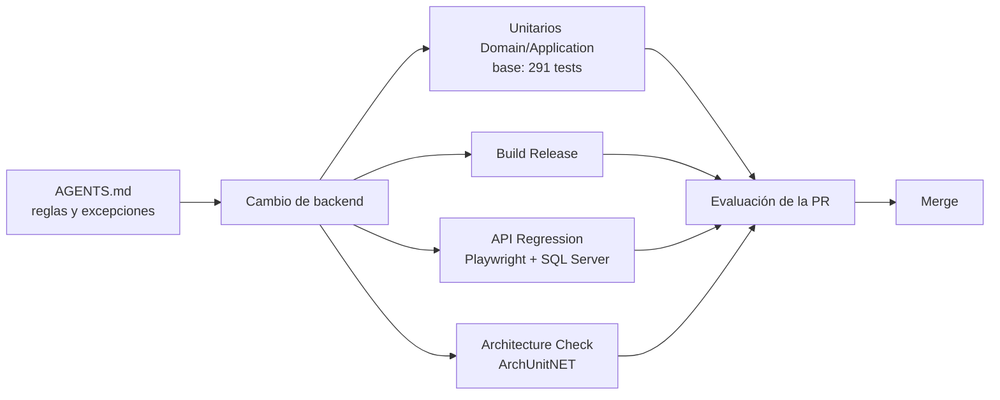

# Reporte de cobertura de calidad y arquitectura

**Proyecto:** AcademiaDigital Backend

**Alcance:** baseline M1–M3 y evolución M4–M11

**Estado del reporte:** 2026-08-24

## Resumen ejecutivo

La estrategia combina controles preventivos y automáticos para detectar defectos en distintos momentos del desarrollo. La matriz conceptual solicitada es:

```text
Reglas operativas (CLAUDE.md / AGENTS.md)
    -> pruebas unitarias
    -> regresión de API
    -> check de arquitectura ArchUnitNET en la PR
```

En este repositorio la fuente operativa existente es [AGENTS.md](../AGENTS.md); actualmente no existe un `CLAUDE.md`. Ambos nombres representan el mismo tipo de control para agentes, pero no se recomienda mantener dos documentos completos porque podrían contradecirse. Si se incorpora `CLAUDE.md`, debería limitarse a dirigir a `AGENTS.md` como única fuente de verdad.

Las etapas representan capas de defensa. En GitHub Actions, Build, API Regression y Backend Architecture pueden ejecutarse en paralelo sobre una pull request; no es necesario esperar que una termine para iniciar conceptualmente la siguiente.

## Matriz general

| Etapa | Objetivo | Herramienta | Cuándo se aplica | Qué valida | Estado actual |
|---|---|---|---|---|---|
| 1. Reglas operativas | Prevenir decisiones incompatibles antes de escribir o revisar código. | `AGENTS.md`, revisión humana y revisión asistida por agentes. | Durante diseño, implementación y code review. | Capas, patrón Command/Query Handler, repositorios, Unit of Work, atomicidad, contratos HTTP, seguridad y excepciones heredadas. | Implementado como control normativo; no produce un check automático por sí solo. |
| 2. Pruebas unitarias | Validar reglas en aislamiento y dar feedback rápido. | xUnit sobre Domain y Application; NSubstitute sólo en puertos. | Durante desarrollo y en el check `Unit Tests` de CI. | Invariantes, transiciones de estado, cálculos y casos de uso sin levantar API ni SQL Server. | Base implementada: 194 tests Domain y 97 Application; M4–M11 cubiertos en aislamiento. |
| 3. Regresión de API | Comprobar que el sistema integrado conserva contratos y datos. | Playwright, TypeScript, Zod, Docker, SQL Server y Allure. | En pull requests hacia `main` que afectan al backend y localmente bajo demanda. | HTTP, autenticación/autorización, flujos críticos, validaciones negativas, atomicidad observable, migraciones/backfill y compatibilidad de respuestas. | Revalidado: migración M1–M11, M11 1/1 y regresión 34/34 el 2026-08-24. |
| 4. Check PR de arquitectura | Detectar deriva estructural automáticamente. | ArchUnitNET, xUnit v3 y GitHub Actions en Debug. | En pull requests y pushes a `main` que afectan al backend; también manualmente. | Dirección de dependencias, aislamiento de controllers y ausencia de ciclos. | Implementado: 8/8 reglas pasaron el 2026-08-24. El check informa Passed/Failed; todavía no está configurado como requisito obligatorio de merge. |

## Flujo de control



## Etapa 1 — Reglas operativas

### Herramienta

[AGENTS.md](../AGENTS.md) funciona como memoria operativa y contrato arquitectónico del backend. Debe consultarse antes de modificar archivos dentro de `backend-dotnet/` y actualizarse cuando cambian arquitectura, riesgos, verificaciones o decisiones vigentes.

### Qué valida

- Dirección permitida entre Domain, Application, Infrastructure y API.
- Responsabilidad y contenido aceptable de cada capa.
- Vertical slices con Command/Query Handler.
- Uso de repositorios específicos y Unit of Work.
- Atomicidad, idempotencia y concurrencia para operaciones multi-entidad.
- Compatibilidad de contratos HTTP y tratamiento central de errores.
- Seguridad 401/403 y no exposición de secretos.
- Excepciones heredadas conocidas, su alcance y condición de retiro.
- Checklist de cierre y comandos mínimos de verificación.

### Naturaleza del control

Es un control preventivo y de revisión: ayuda a que una persona o agente implemente dentro de los límites acordados. No compila ni ejecuta el sistema, por lo que necesita complementarse con las tres capas automáticas siguientes.

## Etapa 2 — Pruebas unitarias

### Herramienta

xUnit v3 para los proyectos `AcademiaDigital.Domain.UnitTests` y `AcademiaDigital.Application.UnitTests`. Los tests ejecutan en memoria y Application sustituye sus puertos mediante NSubstitute.

### Qué deben validar

- Invariantes y servicios puros de Domain.
- Transiciones de estado válidas e inválidas.
- Cálculos académicos, financieros y de vencimientos.
- Handlers de comandos y queries, incluyendo resultados y errores esperados.
- Permisos contextuales de cada caso de uso.
- Idempotencia lógica y respuesta frente a duplicados.
- Casos de borde de fecha mediante `TimeProvider` controlado.

### Qué no deben hacer

- Levantar la API o contenedores.
- Conectarse a SQL Server, filesystem o proveedores externos.
- Duplicar escenarios integrales que pertenecen a API Regression.
- Acoplarse a clases concretas de Infrastructure.

### Estado y brecha

La base funcional tiene 291 tests: 194 en Domain y 97 en Application. Además de elegibilidad, progreso e inscripción, cubre correlativas estrictas, capacidad concurrente por turno, reducción segura de cupos, rechazo antiabuso, rematriculación, documentación, acuerdo/outbox, M5–M9, pagos M10 y recibos M11: correlativo, reserva atómica, generación/reintento, hash, propiedad e historial. El proyecto [AcademiaDigital.ArchitectureTests](../tests/AcademiaDigital.ArchitectureTests/AcademiaDigital.ArchitectureTests.csproj) sigue separado porque inspecciona estructura, no comportamiento.

## Etapa 3 — Regresión de API

### Herramientas

- Playwright Test como runner y cliente HTTP.
- TypeScript para chequeo estático de la suite.
- Zod para validar contratos de respuesta.
- Docker Compose y SQL Server para un ambiente descartable.
- Script dedicado para migración y backfill.
- Allure y reportes Playwright como evidencia de ejecución.

La implementación está en [tests/api-regression](../tests/api-regression/README.md) y el pipeline en [api-regression.yml](../../.github/workflows/api-regression.yml).

### Qué valida

- Inicio, uso y revocación de sesiones.
- Autorización, aislamiento entre estudiantes y respuestas 401/403.
- Códigos HTTP, payloads y esquemas JSON.
- Flujos académicos críticos y consultas principales.
- Validaciones negativas y relaciones incompatibles.
- Rollback y atomicidad observable en operaciones multi-entidad.
- Concurrencia sobre altas sensibles.
- Migración desde el snapshot anterior y backfill.
- Cleanup de datos y repetibilidad de los escenarios.

### Ejecuciones disponibles

| Comando | Cobertura |
|---|---|
| `npm run typecheck` | Tipado y compilación TypeScript sin ejecutar requests. |
| `npm run test:migration` | Migración, backfill y diagnóstico de datos incompatibles. |
| `npm run test:api:smoke` | Verificación rápida de disponibilidad y contratos esenciales. |
| `npm run test:api:critical` | Flujos P0 de mayor impacto. |
| `npm run test:api:negative` | Reglas de validación y rechazos esperados. |
| `npm run test:api:auth` | Autenticación y autorización. |
| `npm run test:api:p1` | Documentos, becas y campos personalizados. |
| `npm run test:api:m10` | Pagos, conciliación, idempotencia, reversión e historial. |
| `npm run test:api` | Regresión completa disponible. |

El workflow conserva los reportes incluso cuando falla la regresión y propaga el resultado al final, permitiendo diagnosticar el defecto mediante los artefactos Allure y Playwright.

## Etapa 4 — Check PR ArchUnitNET

### Herramientas

- `TngTech.ArchUnitNET.xUnitV3` para analizar dependencias del bytecode compilado.
- xUnit v3 como runner.
- GitHub Actions mediante [architecture.yml](../../.github/workflows/architecture.yml).
- Configuración Debug para el análisis de arquitectura.

Las reglas están en [ArchitectureDependencyTests.cs](../tests/AcademiaDigital.ArchitectureTests/ArchitectureDependencyTests.cs).

### Reglas actuales

1. Domain no depende de Application.
2. Domain no depende de Infrastructure.
3. Domain no depende de API.
4. Application no depende de Infrastructure.
5. Application no depende de API.
6. Infrastructure no depende de API.
7. Los controllers no dependen de Infrastructure, excepto la desviación documentada y limitada a `CalendarController`.
8. Las capas `AcademiaDigital.*` no forman ciclos.

### Resultado en una pull request

Una PR hacia `main` que modifica `backend-dotnet/**` obtiene un check independiente de arquitectura con resultado Passed o Failed. Un fallo debe resolverse moviendo la responsabilidad a la capa correcta. Una excepción nueva sólo es válida si fue aprobada, documentada en `AGENTS.md`, limitada en alcance y protegida por una regla explícita; no se debe relajar una prueba únicamente para habilitar el merge.

Para impedir técnicamente el merge cuando falla, el check debe marcarse como requerido en las reglas de protección de la rama `main`. El workflow por sí mismo informa el estado, pero no modifica la política de la rama.

## Control transversal — Build y migraciones

El workflow [backend.yml](../../.github/workflows/backend.yml) agrega una validación transversal:

- restaura y compila `AcademiaDigital.sln` en Release en cada PR hacia `main` que afecte al backend;
- ejecuta en un job independiente `Unit Tests` los proyectos Domain y Application;
- al incluir los proyectos de pruebas en la solución, también verifica que sus fuentes compilen;
- después de un push a `main`, aplica las migraciones a Azure sólo si pasaron Build y Unit Tests.

Compilar no demuestra que el comportamiento sea correcto, pero elimina fallos de sintaxis, referencias, tipos y empaquetado antes de ejecutar o desplegar.

## Cobertura por tipo de riesgo

| Riesgo | Regla operativa | Unitarios | API Regression | ArchUnitNET | Build |
|---|:---:|:---:|:---:|:---:|:---:|
| Deriva entre capas | Sí | Parcial | No | Sí | Parcial |
| Regla de negocio incorrecta | Sí | Sí | Sí | No | No |
| Contrato HTTP incompatible | Sí | No | Sí | No | Parcial |
| Autorización 401/403 | Sí | Sí | Sí | No | No |
| Persistencia o rollback parcial | Sí | Parcial | Sí | No | No |
| Migración/backfill defectuoso | Sí | No | Sí | No | Parcial |
| Dependencia circular | Sí | No | No | Sí | Parcial |
| Error de compilación | No | Sí | Sí | Sí | Sí |
| Evidencia para diagnóstico | Documentación | Salida xUnit | Allure/Playwright | Salida xUnit | Log de CI |

`Sí` en la columna Unitarios describe la cobertura objetivo. La base existe, pero mientras la cobertura siga siendo parcial los riesgos no cubiertos dependen principalmente de API Regression.

## Criterio de calidad para M4–M11

Una entrega de backend está lista para revisión cuando:

1. Respeta `AGENTS.md` y actualiza sus decisiones o excepciones cuando corresponde.
2. Incluye unit tests de toda regla nueva de Domain/Application.
3. Compila en Debug y Release sin errores.
4. ArchUnitNET pasa sus ocho reglas, más cualquier regla nueva agregada por el módulo.
5. El typecheck de API Regression pasa.
6. Pasan migración, smoke y la suite del módulo afectado.
7. La regresión completa pasa antes del merge cuando el cambio altera contratos, persistencia o reglas compartidas.
8. Los reportes de CI permiten identificar rápidamente el escenario y la causa del fallo.

## Próximos incrementos recomendados

1. Estabilizar y preparar el release de M4–M11 sin reabrir su alcance funcional.
2. Mantener migración M1–M11 y los 34 escenarios como baseline obligatorio de los siguientes incrementos.
3. Convertir Backend Architecture y API Regression en checks requeridos de `main` cuando el equipo quiera bloquear merges automáticamente.
4. Eliminar la excepción de `CalendarController` cuando sus consultas y escrituras migren a handlers de Application.
5. Mantener actualizada la matriz endpoint–permiso–test por cada cambio de contrato o autorización.

## Evidencia vigente

- ArchUnitNET: **8/8 reglas pasaron** el 2026-08-24.
- Build de solución Release: **0 warnings, 0 errores** el 2026-08-24.
- Unit tests: **291/291** —194 Domain y 97 Application— el 2026-08-24.
- EF Core: modelo sin cambios pendientes; migración/backfill M1–M11 aprobado el 2026-08-24.
- API Regression: typecheck, migración/backfill M1–M11, M4 **7/7**, M5 **3/3**, M6–M11 **1/1** cada uno y **34/34** escenarios pasaron sobre SQL Server Docker el 2026-08-24; Swagger confirmó 196 operaciones y Allure fue generado.

La evidencia de una ejecución siempre prevalece sobre este resumen. Este documento debe actualizarse cuando se agregue una nueva capa de pruebas, cambien los workflows o se modifique una regla arquitectónica.
